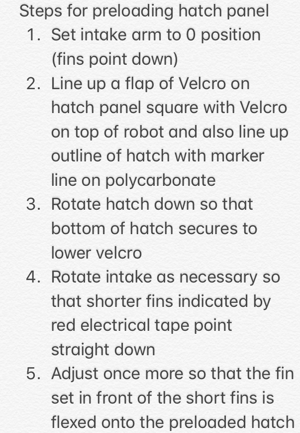

# Smol Boi - deep-space-2019
Source code for the 2019 FRC season - Deep Space
[](https://travis-ci.org/PearceRobotics/deep-space-2019)

### Getting Started
- Install [GitHub desktop](https://desktop.github.com/) to push and pull from GitHub
- Install [Java JDK 11](https://www.oracle.com/technetwork/java/javase/downloads/jdk11-downloads-5066655.html) and ensure `java -version` shows you are using JDK 11 (note you *will* need to set your java path to JDK 11)
  - [How to set your java path](https://www.java.com/en/download/help/path.xml)
- Install [VSCode](https://code.visualstudio.com/)
  - Within VSCode install the follow extensions:
    - [WPILib - wpilibsuite.vscode-wpilib](https://marketplace.visualstudio.com/items?itemName=wpilibsuite.vscode-wpilib)
    - [Java Extension Pack - vscjava.vscode-java-pack](https://marketplace.visualstudio.com/items?itemName=vscjava.vscode-java-pack) 

### Build
_Note: *nix users may have to `chmod +x gradlew` to give the executable the right permissions
- ```./gradlew build``` will build your Robot Code
- ```./gradlew deploy``` will build and deploy your code. (Note, make sure you are connected to the robot network)
- ```./gradlew riolog``` will display the RoboRIO console output on your computer (run with `-Pfakeds` if you don't have a driverstation connected).


### Controls


### Hatch Sandstorm/Auto Preload Steps

